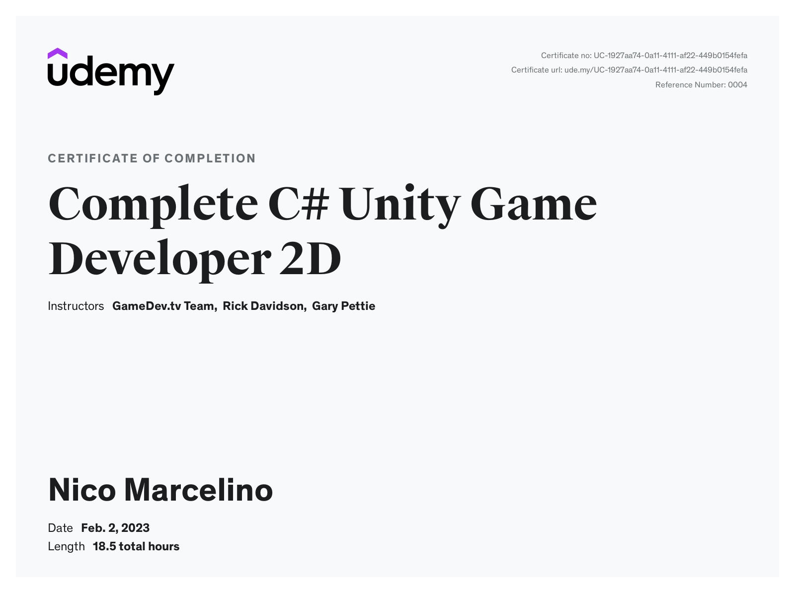
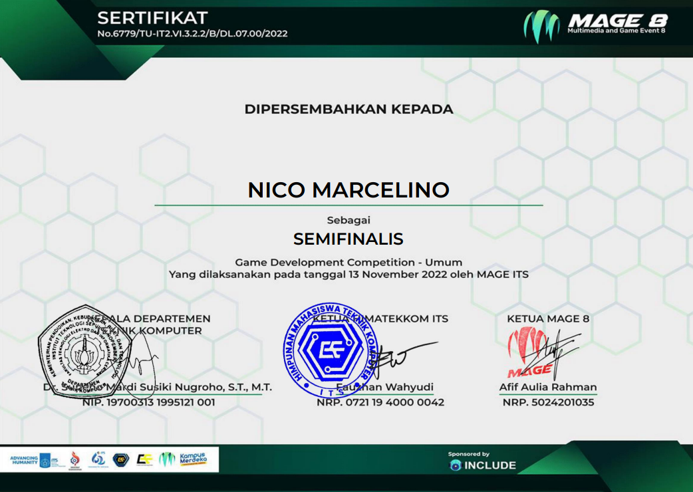

---
layout:
  title:
    visible: true
  description:
    visible: false
  tableOfContents:
    visible: true
  outline:
    visible: true
  pagination:
    visible: true
---

# Game Development

[Complete C# Unity Game Developer 2D - GameDev.tv Team (Udemy)](https://www.udemy.com/certificate/UC-1927aa74-0a11-4111-af22-449b0154fefa/)

<figure><figcaption></figcaption></figure>

***

MAGE8 Game Development Competition Semifinalist Certificate - ITS

<figure><figcaption></figcaption></figure>
