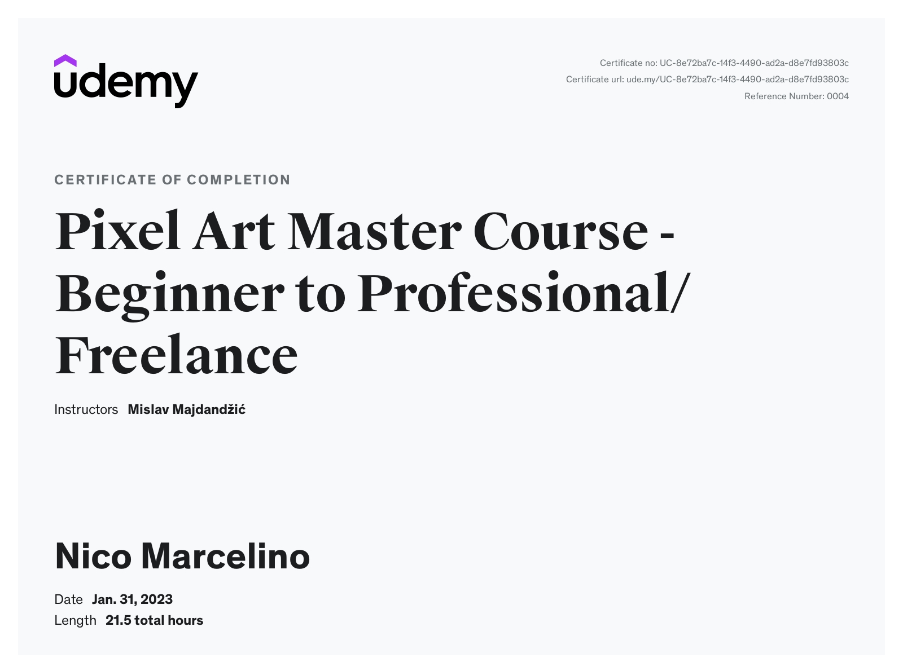

---
layout:
  title:
    visible: true
  description:
    visible: false
  tableOfContents:
    visible: true
  outline:
    visible: true
  pagination:
    visible: true
---

# Others

[Pixel Art Master Course - Beginner to Professional/Freelance - Mislav Majdandžić (Udemy)](https://www.udemy.com/certificate/UC-8e72ba7c-14f3-4490-ad2a-d8e7fd93803c/)

<figure><figcaption></figcaption></figure>

***

IConNECT'23 Presenter Certificate - Universitas Teknokrat Indonesia

<figure><figcaption></figcaption></figure>
