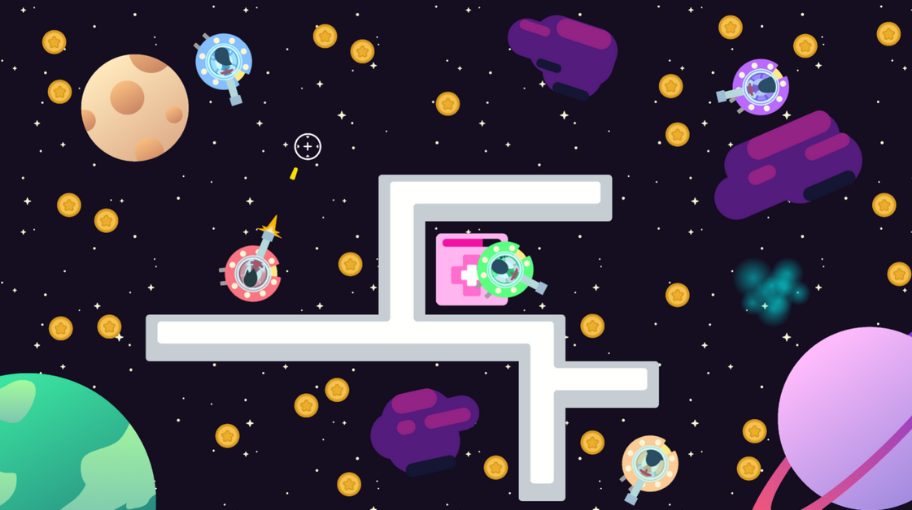

---
layout:
  title:
    visible: true
  description:
    visible: false
  tableOfContents:
    visible: true
  outline:
    visible: true
  pagination:
    visible: true
---

# Cosmic Clash (2024)

**Cosmic Clash** is a 2D top-down shooter where you pilot a spaceship and shoot down other spaceships. The goal is to obtain the most coins. These coins can either be obtained by picking them up from the ground, or defeating other players and picking up their coins. This game is only for internal use within **PT Freeport Indonesia.**

<figure><figcaption>
Banner
</figcaption></figure>

This game features:

* **Multiplayer PvP:** Players will be able to connect and battle against other players through the Internet.
* **Team Gamemode:** The game provides a team-based gamemode, where players can play as a team and collect coins together to work towards a shared goal, whilst fighting against other teams.
* **Coin Collection:** Players can pick up coins that are scattered throughout the map. Defeated players will also drop a set percentage of their coins before they respawn. These coins can be picked up by anyone.

<figure><figcaption>
Gameplay (without HUD)
</figcaption></figure>


This game was made during my internship in PT Freeport Indonesia. It was made using C# in the Unity Engine and the art assets were provided by the company's creative team.


**My roles in this project:** Project Lead, Programmer, Game Designer

**Stats:**

* Genre: 2D, Top-down, Shooter, Multiplayer, PvP
* Platform: Windows, Browser
* Game Length: 15 minutes
* Gamemode: Multiplayer
* Developer: PTFI Creative Team
* Publisher: Not published
* Language: English
