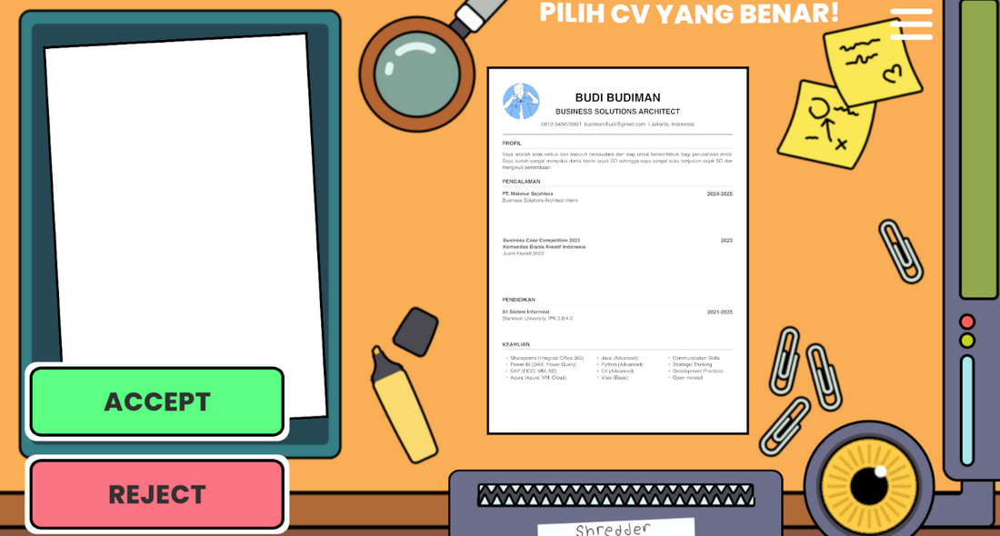
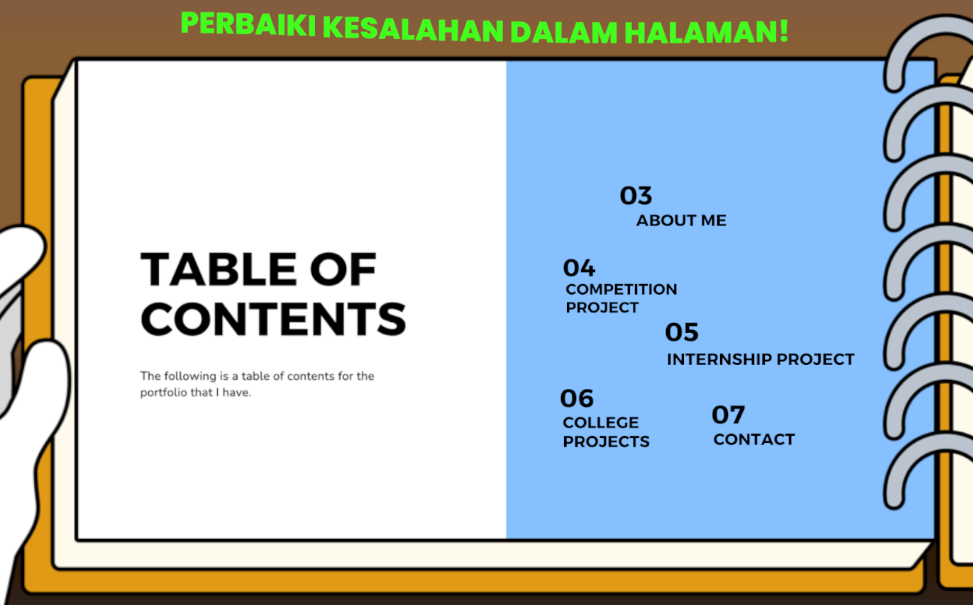

---
layout:
  title:
    visible: true
  description:
    visible: false
  tableOfContents:
    visible: true
  outline:
    visible: true
  pagination:
    visible: true
---

# Karirku Games (2024)

**Karirku Games** is a collection of minigames designed to prepare PTFI's interns before entering the working world. The minigames cover work topics like Linkedin pages, CVs, portfolios and the interview process. This game is only for internal use within **PT Freeport Indonesia.**

<figure><figcaption>
Banner
</figcaption></figure>

This game covers several parts of the job finding process:

*   **Linkedin:** Players will build a mock Linkedin page to simulate the process of creating a real one. They will create and design each part of the page to form one complete Linkedin page. Each part has their own unique minigame which has to be completed. The parts of the page that are made include:

    * Header
    * About section
    * Featured works
    * Education
    * Skills
    * Languages
    * Recommendations by others

<figure><figcaption>
Skill section gameplay
</figcaption></figure>

* **CV:** Players will create and verify their CVs to make sure they are of high-quality. Players will be taught what goes into a CV and how to write them properly in ATS format.

<figure><figcaption>
CV gameplay
</figcaption></figure>

* **Portfolio:** Players will be taught how to build their porfolios properly, including introductions and showing off their works.

<figure><figcaption>
Portfolio gameplay
</figcaption></figure>

* **Interview:** Players will be given a mock interview with an HR personnel to simulate the real process. The player will be given questions and several choices. They will have to pick the correct ones to complete the interview.


This game was made during my internship in PT Freeport Indonesia. It was made using C# in the Unity Engine alongside [ReXIGnoTuS](https://rexignotus.itch.io/). and the art assets were provided by the company's creative team.


**My roles in this project:** Programmer, Game Designer

**Parts of the project I made:** Minigame management, Header minigame, Featured minigame, Education minigame, Skills minigame, CV minigame, Portfolio minigame.

**Stats:**

* Genre: 2D, Puzzle
* Platform: Windows, Browser
* Game Length: 30 minutes
* Gamemode: Singleplayer
* Developer: PTFI Creative Team
* Publisher: Not published
* Language: English, Indonesian
