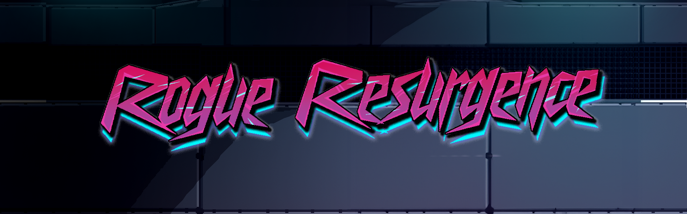
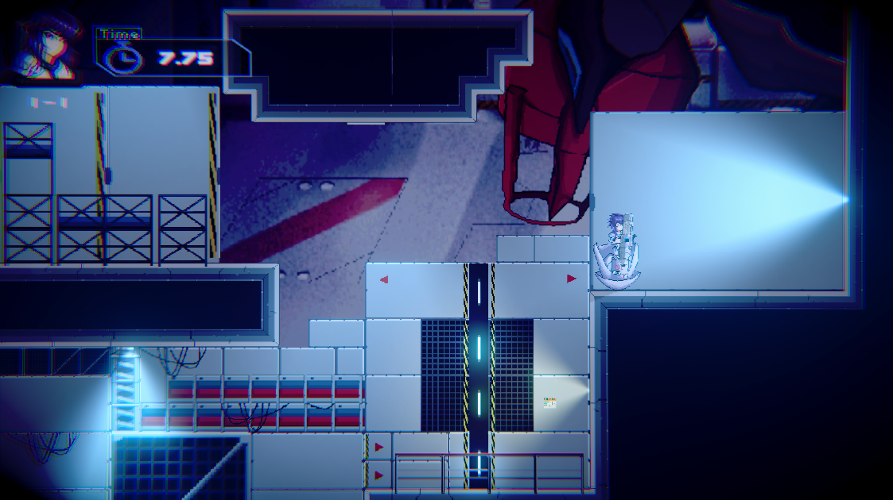
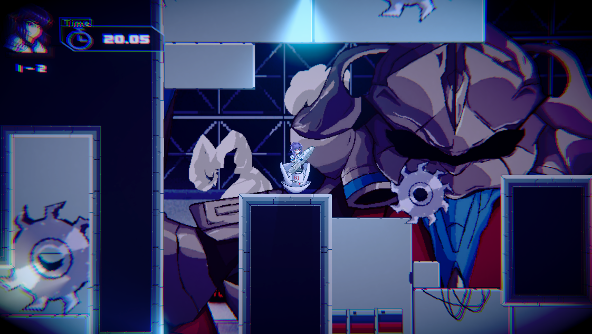

---
layout:
  title:
    visible: true
  description:
    visible: false
  tableOfContents:
    visible: true
  outline:
    visible: true
  pagination:
    visible: true
---

# Rogue Resurgence (2023)

**Rogue Resurgence** is a 2D platformer where you play as a brave robot armed with a powerful rocket launcher. The goal is simple: navigate a difficult obstacle course by using the rocket launcher's explosive thrust to propel yourself across wide gaps, over hazards, and past various obstacles. Currently, this game is only a demo.

<figure><figcaption>
Banner
</figcaption></figure>

This game features:

* **Rocket-Powered Propulsion:** Unlike traditional platformers, where jumping is the primary means of movement, Rogue Resurgence relies entirely on rocket-powered propulsion. Players must carefully time and aim their rocket blasts to move in any direction.&#x20;
* **Physics-Based Challenges:** The movement and behavior of the rocket-powered robot are governed by realistic physics.
* **Progressive Difficulty:** The game features a gradually increasing difficulty curve, allowing players to steadily improve their rocket riding skills.

<figure><figcaption>
Gameplay 1
</figcaption></figure>

<figure><figcaption>
Gameplay 2
</figcaption></figure>


This game was made for my college's Game Development Capstone Project class. It was made using C# in the Unity Engine alongside [ReXIGnoTuS](https://rexignotus.itch.io/). The sprites and artwork were created by [Velius](https://vel1us.itch.io/).


**My roles in this project:** Project Lead, Programmer, Game Designer

Other people who worked on this:





**Stats:**

* Genre: 2D, Sidescroller, Platformer, Physics
* Platform: Windows
* Game Length: 5 minutes
* Gamemode: Singleplayer
* Developer: Undersleepers
* Publisher: Undersleepers
* Language: English
