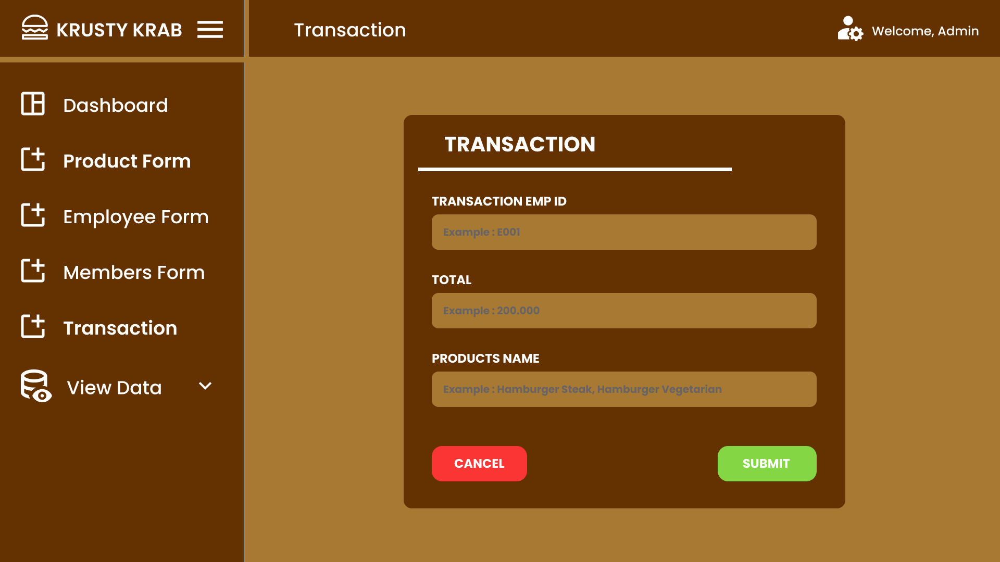

---
layout:
  title:
    visible: true
  description:
    visible: false
  tableOfContents:
    visible: true
  outline:
    visible: true
  pagination:
    visible: true
---

# Krusty Krabs App

Krusty Krab App is a concept for a theoretical application that would be used to help manage the Krusty Krabs. It uses a database management system to accomplish this. The concept was made in Figma.

<figure><figcaption>
Login
</figcaption></figure>

<figure><figcaption>
Dashboard
</figcaption></figure>

<figure><figcaption>
View Data - Main Dish
</figcaption></figure>

<figure><figcaption>
View Data - Report
</figcaption></figure>

<figure><figcaption>
View Data - Transaction
</figcaption></figure>

<figure><figcaption>
View Data - Employees
</figcaption></figure>

<figure><figcaption>
View Data - Edit Employee
</figcaption></figure>

<figure><figcaption>
View Data - Delete Employee
</figcaption></figure>

<figure><figcaption>
Product Types
</figcaption></figure>

<figure><figcaption>
Add Product
</figcaption></figure>

<figure><figcaption>
Add Employee
</figcaption></figure>

<figure><figcaption>
Add Transaction
</figcaption></figure>
