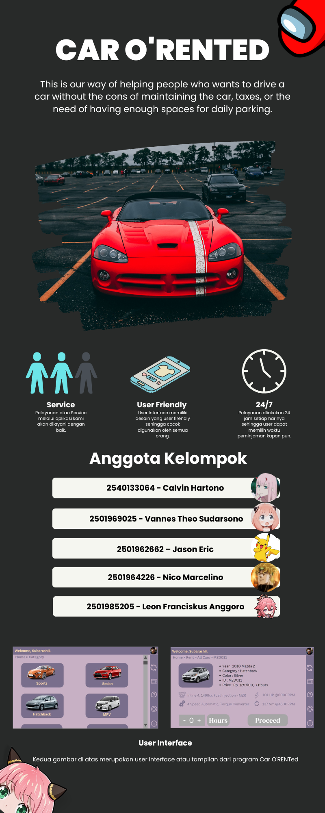

---
layout:
  title:
    visible: true
  description:
    visible: false
  tableOfContents:
    visible: true
  outline:
    visible: true
  pagination:
    visible: true
---

# O'Rented Application

O'Rented is a mobile app that can facilitate the process of renting a motor vehicle. With the app, a renter could choose a vehicle that is provided by their owners. Once chosen, the renter and owner will be able to communicate and negotiate the terms of renting. An owner can register their vehicles in the app so they can be rented.

O'Rented was made for my group Object Oriented Programming college assignment.

<figure><figcaption>
Poster made for the assignment
</figcaption></figure>

***

[Application test results](https://docs.google.com/document/d/1G3eFlXwjVPC-TrZb51eYKuby\_dZ6RgQX5Q8LowzPs5c/edit?usp=sharing)


